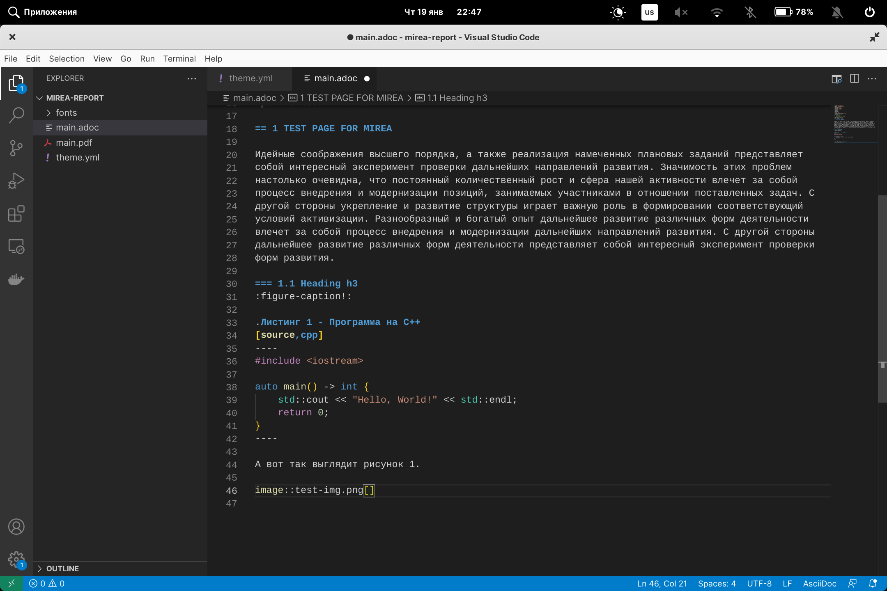

= {blank}
:author: devLAB InSys
:email: devlab@insys.ru
:revnumber: 1.0
:revdate: {docdate}
:doctype: book
:notitle:
:front-cover-image: image:title/sample.pdf[]
:lang: ru,en
:docinfo:
:pagenums:
:icons: font
:pdf-page-size: A4
:toc:
:toclevels: 3
:toc-title: СОДЕРЖАНИЕ
:pdf-theme: theme.yml
:pdf-fontsdir: fonts
:figure-caption: Рисунок
:listing-caption: Листинг
:table-caption: Таблица

== 1 TEST PAGE FOR MIREA

Идейные соображения высшего порядка, а также реализация намеченных плановых заданий представляет
собой интересный эксперимент проверки дальнейших направлений развития. Значимость этих проблем 
настолько очевидна, что постоянный количественный рост и сфера нашей активности влечет за собой 
процесс внедрения и модернизации позиций, занимаемых участниками в отношении поставленных задач. С 
другой стороны укрепление и развитие структуры играет важную роль в формировании соответствующий 
условий активизации. Разнообразный и богатый опыт дальнейшее развитие различных форм деятельности 
влечет за собой процесс внедрения и модернизации дальнейших направлений развития. С другой стороны 
дальнейшее развитие различных форм деятельности представляет собой интересный эксперимент проверки 
форм развития.

Идейные соображения высшего порядка, а также реализация намеченных плановых заданий представляет
собой интересный эксперимент проверки дальнейших направлений развития. Значимость этих проблем 
настолько очевидна, что постоянный количественный рост и сфера нашей активности влечет за собой 
процесс внедрения и модернизации позиций, занимаемых участниками в отношении поставленных задач. С 
другой стороны укрепление и развитие структуры играет важную роль в формировании соответствующий 
условий активизации. Разнообразный и богатый опыт дальнейшее развитие различных форм деятельности 
влечет за собой процесс внедрения и модернизации дальнейших направлений развития. С другой стороны 
дальнейшее развитие различных форм деятельности представляет собой интересный эксперимент проверки 
форм развития.

=== 1.1 Первая глава курсовой работы
:listing-number: 0
:figure-number: 0

Вот так выглядит листинг с исходным кодом (Листинг 1).

.Программа на C++
[source,cpp,caption="Листинг 1.{counter:Листинг} - "]
----
#include <iostream>

auto main() -> int {
    std::cout << "Hello, World!" << std::endl;
    return 0;
}
----

А вот так выглядит рисунок (Рисунок 1).

.Какой-то рисунок

=== 1.2 Вторая глава курсовой работы
:listing-number: 0
:figure-number: 0

.Программа на C++
[source,cpp]
----
#include <iostream>

auto main() -> int {
    std::cout << "Hello, World!" << std::endl;
    return 0;
}
----

А вот так выглядит рисунок 1.

.Какой-то рисунок

== 2 NEW HEADING H2

Идейные соображения высшего порядка, а также реализация намеченных плановых заданий представляет
собой интересный эксперимент проверки дальнейших направлений развития. Значимость этих проблем 
настолько очевидна, что постоянный количественный рост и сфера нашей активности влечет за собой 
процесс внедрения и модернизации позиций, занимаемых участниками в отношении поставленных задач. С 
другой стороны укрепление и развитие структуры играет важную роль в формировании соответствующий 
условий активизации. Разнообразный и богатый опыт дальнейшее развитие различных форм деятельности 
влечет за собой процесс внедрения и модернизации дальнейших направлений развития. С другой стороны 
дальнейшее развитие различных форм деятельности представляет собой интересный эксперимент проверки 
форм развития.

== СПИСОК ИНФОРМАЦИОННЫХ ИСТОЧНИКОВ

1. JSON Web Tokens — технология авторизации и аутентификации [Электронный ресурс]. 
Режим доступа: https://jwt.io/ (дата посещения 6.11.2022).

2. Rust — язык программирования [Электронный ресурс]. 
Режим доступа: https://www.rust-lang.org/ (дата посещения 6.11.2022).

3. Actix Web — фреймворк для разработки интернет ресурсов на языке программирования 
Rust [Электронный ресурс]. 
Режим доступа: https://actix.rs/ (дата посещения 6.11.2022).

4. Serde — библиотека сериализации и десериализации данных [Электронный ресурс]. 
Режим доступа: https://serde.rs/ (дата посещения 6.11.2022).

5. MySQL docs — документация по MySQL [Электронный ресурс].
Режим доступа: https://dev.mysql.com/doc/ (дата посещения 6.11.2022).
